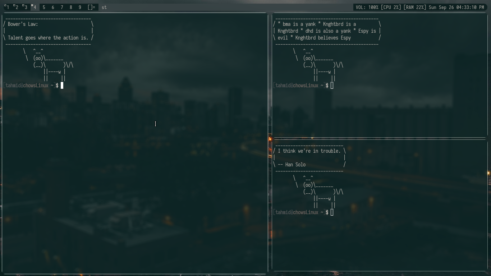

## Introduction
This is my fork of [dwm](https://dwm.suckless.org).

## Patches
I have used **five** patches in this config.
They are described below:
* [gaps](https://dwm.suckless.org/patches/gaps) - Gaps between the window
* [scratchpad](https://dwm.suckless.org/patches/scratchpad) - A terminal that you can toggle.
* [swallow](https://dwm.suckless.org/patches/swallow) - Swallow terminal, a [demo](https://yewtu.be/92uo5OBOKfY) here.
* [actualfullscreen](https://dwm.suckless.org/patches/actualfullscreen) - super+f to fullscreen
* [alwayscenter](https://dwm.suckless.org/patches/alwayscenter) - It will open all floating window in center.
* [focusonclick](https://dwm.suckless.org/patches/focusonclick/) - It will disable the default sloppy focus.
* [barpadding](https://dwm.suckless.org/patches/barpadding/) - You can set padding in the bar.

## ScreenShot
By default value of gaps and barpadding are set to 0. Change the
following value if you want your dwm look like below:

```
static const unsigned int gappx     = 5;        /* gaps between windows */
static const int vertpad            = 10;       /* vertical padding of bar */
static const int sidepad            = 10;       /* horizontal padding of bar */
```



The above bar is [slstatus](https://tools.suckless.org/slstatus). If you want to get my slstatus get it from [here](https://github.com/TahmidChow06/slstatus).

## Installation
```
git clone https://github.com/TahmidChow06/neovim ~/.config/dwm
sudo make install
```

It will clone the config in ~/.config/dwm. and install dwm.


## Keybinding
Bindings that were changed are mentioned below:

| Keybinding        | Description                   |
|-------------------|-------------------------------|
| super+Enter       | To open St                    |
| super+shift+h     | Take current window to master |
| super+shift+enter | toggles scratchpad            |
| super+f           | full screen                   |
| super+ctrl+enter  | to toggle floating layout     |

And few bindings are also added. Like volume up, down and mute.
